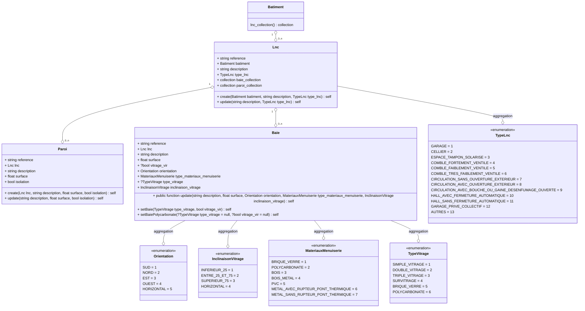

# Locaux non chauffés (LNC)

Prise en compte des locaux non chauffés pour la détermination des coefficient de réduction des déperditions et des apports solaires.

## Usage

```
use App\Domain\Lnc\Lnc;
use App\Domain\Lnc\MasqueLointainBuilder;
use App\Domain\MasqueLointain\Enum\Orientation;

$builder = new MasqueLointainBuilder;
$builder->create(batiment: $batiment, description: 'Un masque proche');
$entity = $builder->
$entity = $builder->setFondBalconOuFondFlancLoggias(avancee: 2, orientation: Orientation::SUD);
$entity = $builder->setBalconOuAuvent(avancee: 2);
$entity = $builder->setParoiLaterale(obstacle_au_sud: true);
```

## Modélisation



## Opendata

### Cas des espaces tampons solarisés

Les espaces tampons solarisés peuvent être déduites de la valeur `tv_coef_transparence_ets_id` de chaque `ets` en complement des données d'entrée `baie_ets`.

### Cas des autres locaux non chauffés

Le modèle open data n'impose pas une description des locaux non chauffés. Ces données sont donc déduites des valeurs de `tv_coef_reduction_deperdition_id` :

1. Récupération de toutes les valeurs uniques `enum_type_lnc_id` et `isolation_aue` des lignes `tv_b` correspondant à `tv_coef_reduction_deperdition_id`
2. Pour chaque valeur de `tv_b` trouvé, on recherche l'ensemble des parois correspondantes
3. Pour chaque valeur de `tv_b` trouvé, création d'un LNC sur la base des colones `enum_type_lnc_id`,  `isolation_aue` et `aiu_aue_defaut`

## Remarques

### Définition d'un espace tampon solarisé

La méthode 3CL-DPE n'offre pas de définition d'un espace tampon solarisé. Il est proposé d'indiquer un taux de surface vitrée donnant sur l'extérieur au delà duquel un local non chauffé doit être considéré comme un espace tampon solarisé.
