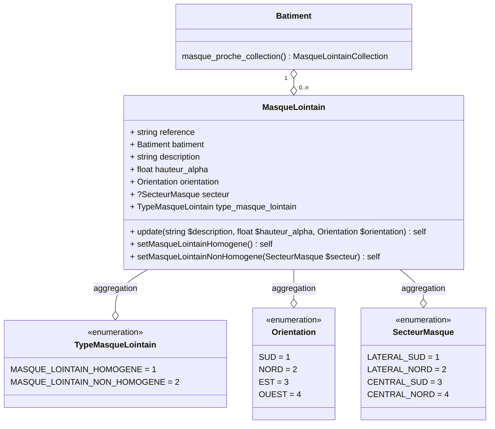

# Masques lointains

Prise en compte des obstacles d'environnement lointains pour la détermination du facteur d'ensoleillement.

## Usage

```
use App\Domain\MasqueLointain\MasqueLointainBuilder;
use App\Domain\MasqueLointain\Enum\Orientation;

$builder = new MasqueLointainBuilder;
$builder->create(batiment: $batiment, description: 'Un masque proche');
$entity = $builder->
$entity = $builder->setFondBalconOuFondFlancLoggias(avancee: 2, orientation: Orientation::SUD);
$entity = $builder->setBalconOuAuvent(avancee: 2);
$entity = $builder->setParoiLaterale(obstacle_au_sud: true);
```

## Modélisation



## Opendata

Le modèle open data actuel n'exige pas une description des masques proches, qui peuvent cependant être déduits de la valeur `tv_fe1_id` de chaque `baie`:

1. Récupération de toutes les valeurs uniques de `tv_fe1_id`
2. Pour chaque valeur unique `tv_fe1_id`, création d'un masque proche sur la base des colones `enum_type_masque_proche_id` et `avancee_defaut` de la table `tv_fe1`

### Exemple

audit/logement/enveloppe/baie_vitree_collection/baie_vitree/donnee_entree/enum_orientation_id = 3
audit/logement/enveloppe/baie_vitree_collection/baie_vitree/donnee_entree/tv_coef_masque_proche_id = 8

#### Valeur de la table `tv_fe1`

| tv_fe1_id | enum_type_masque_proche_id | enum_orientation_id | avancee_gte | avancee_lt | avancee_defaut | fe1 |
|:---------:|:--------------------------:|:-------------------:|:-----------:|:----------:|:--------------:|:---:|
| 7 | 1 | 3|4 | 0 | 1 | 0.5 | 0.45 |

#### Résultat

| variable | valeur |
|:--------:|:------:|
| description | Masque proche n°XX |
| avancee | 0.5 |
| orientation | 3 |
| type_masque_proche | 1 |


# Masques lointains

La saisie des masques lointains est effectuée à la maille du bâtiment.

## Données d'entrée

| variable | type | description | couverture_opendata |
|:--------:|:----:|:-----------:|:-------------------:|
| description | string | Description libre du masque lointain | Donnée optionnelle |
| hauteur_alpha | float | Hauteur moyenne de l'obstable en ° | Non - Variable déduite de `tv_fe2` ou `tv_omb` |
| orientation | enum | Orientation du masque lointain | Non - Variable déduite de `tv_fe2` ou `tv_omb` |
| type_masque | enum | Type de masque lointain | Non - Variable déduite de `tv_fe2` ou `tv_omb` |
| secteur | enum\|null | Type de masque proche | Non - Variable déduite de `tv_omb` |

### Depuis l'opendata

1. Récupération de toutes les valeurs uniques de `tv_fe2` 
2. Récupération de toutes les valeurs uniques de `tv_omb`
3. Pour chaque valeur unique `tv_fe2`, création d'un masque lointain sur la base des colones `enum_orientation_id` et `hauteur_alpha_defaut`
4. Pour chaque valeur unique `tv_omb`, création d'un masque lointain sur la base des colones `enum_secteur_masque_id`, `enum_orientation_id` et `hauteur_alpha_defaut`

## Données intermédiaires

| variable | description |
|:--------:|:-----------:|
| fe2 | Facteur d'ensoleillement dû aux obstacles loitains |
| omb | Ombrage dû aux obstacles loitains non homogènes |
