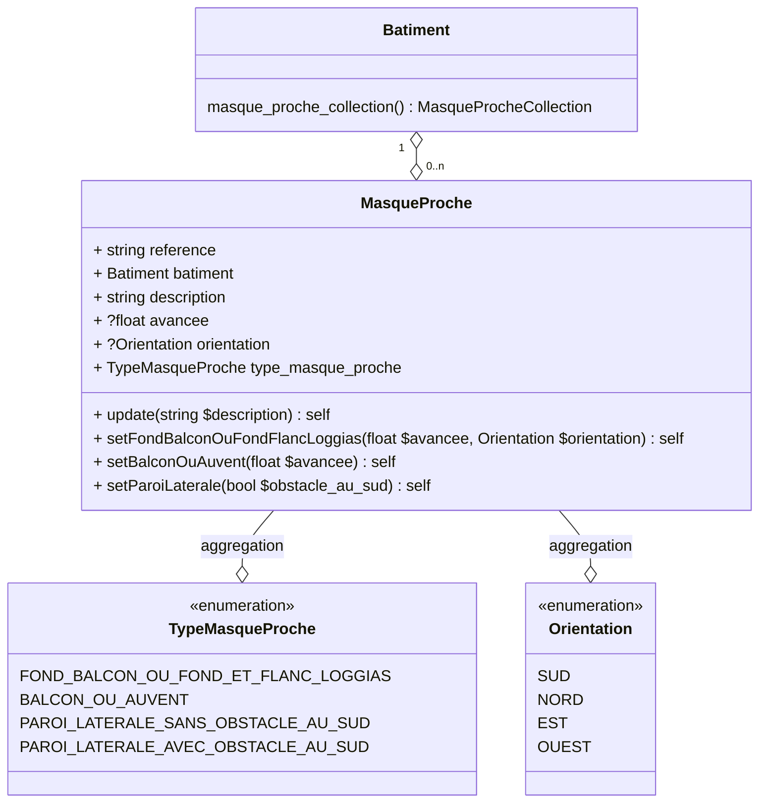

# Masques proches

Prise en compte des masques proches pour la détermination du facteur d'ensoleillement.

## Usage

```
use App\Domain\MasqueProche\MasqueProcheBuilder;
use App\Domain\MasqueProche\Enum\Orientation;

$builder = new MasqueProcheBuilder;
$builder->create(batiment: $batiment, description: 'Un masque proche');
$entity = $builder->
$entity = $builder->setFondBalconOuFondFlancLoggias(avancee: 2, orientation: Orientation::SUD);
$entity = $builder->setBalconOuAuvent(avancee: 2);
$entity = $builder->setParoiLaterale(obstacle_au_sud: true);
```

## Modélisation



## Opendata

Le modèle open data actuel n'exige pas une description des masques proches, qui peuvent cependant être déduits de la valeur `tv_fe1_id` de chaque `baie`:

1. Récupération de toutes les valeurs uniques de `tv_fe1_id`
2. Pour chaque valeur unique `tv_fe1_id`, création d'un masque proche sur la base des colones `enum_type_masque_proche_id` et `avancee_defaut` de la table `tv_fe1`

### Exemple

audit/logement/enveloppe/baie_vitree_collection/baie_vitree/donnee_entree/enum_orientation_id = 3
audit/logement/enveloppe/baie_vitree_collection/baie_vitree/donnee_entree/tv_coef_masque_proche_id = 8

#### Valeur de la table `tv_fe1`

| tv_fe1_id | enum_type_masque_proche_id | enum_orientation_id | avancee_gte | avancee_lt | avancee_defaut | fe1 |
|:---------:|:--------------------------:|:-------------------:|:-----------:|:----------:|:--------------:|:---:|
| 7 | 1 | 3|4 | 0 | 1 | 0.5 | 0.45 |

#### Résultat

| variable | valeur |
|:--------:|:------:|
| description | Masque proche n°XX |
| avancee | 0.5 |
| orientation | 3 |
| type_masque_proche | 1 |
